# [나의 작은 도서관 📚](https://www.najackdo.kro.kr/)

## Index
#### &emsp; [➤ 프로젝트 소개](#-프로젝트-소개) 
#### &emsp; [➤ 프로젝트 설계](#-프로젝트-설계) 
#### &emsp; [➤ 기능 소개](#-기능-소개) 
#### &emsp; [➤ 산출물](#-산출물) 
 

# 📚 프로젝트 소개
* ## 기획 배경
  2021년 기준, 한 해에 한 권 이상 독서하는 인구 비율이 절반에 미치지 못하며, 시간이 지날수록 급격히 감소하는 추세를 보이고 있다. 
    
  또한, 한국은 독일과 호주 등 다른 선진국에 비해 도서관 수가 상대적으로 부족한 상황이다.
    
  잉여 도서를 활용하여 지역 기반 책 클라우드를 구축함으로써 문제를 해결하고자 했다. 
    
  이를 통해 서비스를 이용하는 사용자가 관심 가질 만한 책을 추천받아 독서의 재미를 느낄 수 있도록 하여, 독서율을 높이고자 프로젝트를 진행하게 되었다.

* ## 서비스 소개

  ### 중고 책 공유 서비스

  1. AI를 활용한 편리한 책 등록 및 품질 판단

  2. 직거래 만남을 위한 실시간 채팅 서비스
  
  3. 메타데이터를 기반으로 한 책 추천 기능
  
  4. 위치 정보를 이용한 동네 기반 서비스
  
  5. 만남이나 대출, 반납을 위한 편리한 알람 기능

 

* ## 프로젝트 기간
  | 프로젝트 기간 | 2024.08.26 ~ 2024.10.11 (8주) |
  |---|---|
 

* ## 팀 소개

  | Contributors | Role | Position |
  | ------------ | ---- | -------- |
  |  황성민 | 팀장 | - AI  - 추천 알고리즘  - 백엔드|
  | 　박범수 | 팀원 | - AI  - 추천 알고리즘  - 백엔드|
  | 　이인준 | 팀원 | - Infra - 프론트엔드  - 백엔드 |
  | 　김도영 | 팀원 | - UI/UX디자인  - 퍼블리싱 - 프론트엔드 |
  | 　서민수 | 팀원 | - UI/UX디자인  - 퍼블리싱 - 프론트엔드 |
  | 　정하림 | 팀원 | - UI/UX디자인  - 퍼블리싱 - 프론트엔드 |

 

# 📚 프로젝트 설계
* ## 개발 환경

  FE: React 18.3.1, TypeScript, React, PWA  
  BE: Java 17, SpringBoot 3.3.3, RabbitMQ  
  DB: Postgresql 16.3, Redis, Mongo  
  Infra: Ubuntu 20.04, Docker

  <h3>AI</h3>
  

   
  
  
  

  <h3>Frontend</h3>
  

  
  
  
  
  
  
  
  

  <h3>Backend</h3>
  

  
  
    
  <!--  
   -->
  

  <h3>Database</h3>
  

  
  
    
  

  <h3>Infra</h3>
  

   
   
   
  
   

  <h3>협업 툴</h3>
  

  
  
  

 

 
  
 

# 📚 기능 소개
* ### **1.&nbsp; AI를 활용한 편리한 책 등록 및 품질 판단**
  
1.1 yolov9과 OCR을 활용한 책 등록

  
&emsp;1.1.2 단일 책 등록

  
&emsp; 텍스트 검색이나, ISBN 바코드 촬영을 통해 단일 도서를 간편하게 등록할 수 있습니다.

  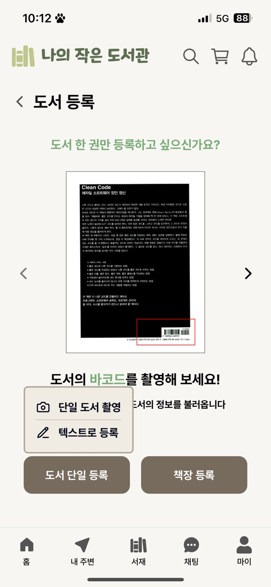
  
  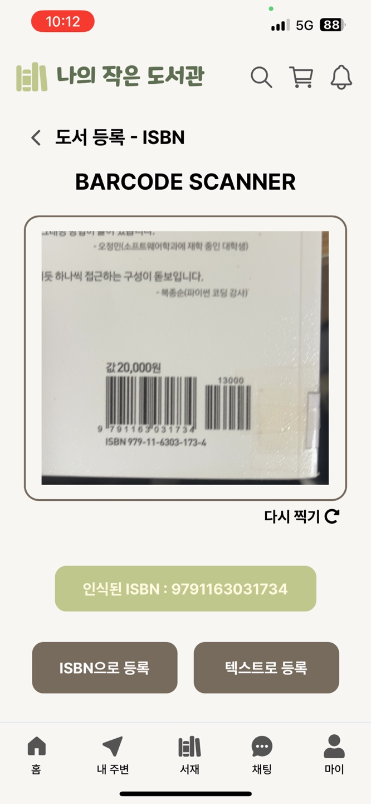
  
  
&emsp;1.1.2 책장 등록

  
&emsp; 책장 사진을 찍으면 책등을 detection 하고, OCR을 통해 책등의 텍스트를 추출한다. 이후 DB의 책 제목 중 가장 유사한 책 정보를 제공합니다.

  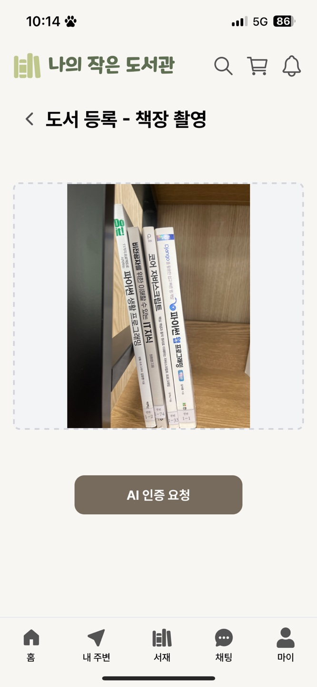
  
    
  
1.2 yolov9을 기반으로 book damage Detection을 통한 책 품질 검사

  
  
  
 
  
* ### **2.&nbsp; 직거래 만남을 위한 실시간 채팅 서비스**
  
2.1 책장 기준 장바구니 담기

  
&emsp; 도서 상세페이지에서 책을 하나씩 장바구니에 담거나 유저의 책장에서 여러권을 한번에 장바구니에 담을 수 있습니다.

  
  
  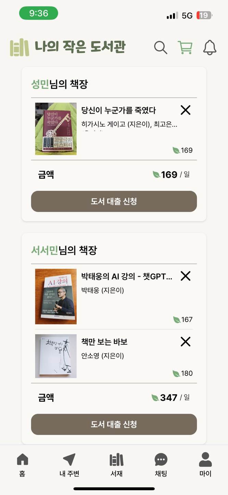
    

  
2.2 대출 신청을 통한 채팅방 자동 생성

  
&emsp; 도서 대출을 신청하면 장바구니를 기준으로 채팅방이 자동 생성됩니다.

  
  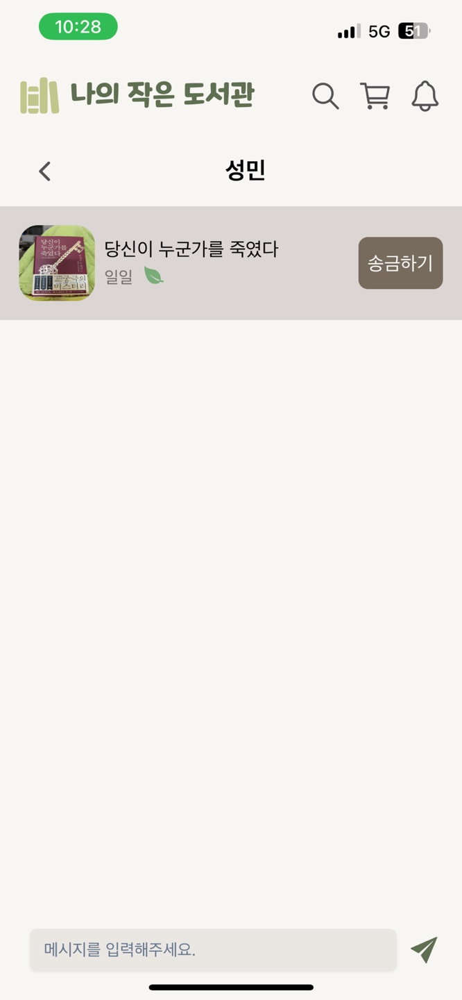
  
    
  
  
2.3 도서 대출 기간을 설정하고 알맞는 금액을 송금

  
&emsp; 도서 대출 기간을 설정하고 책잎을 송금하면 대출 신청이 완료됩니다.

  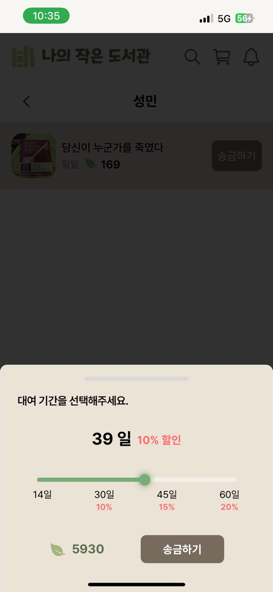
  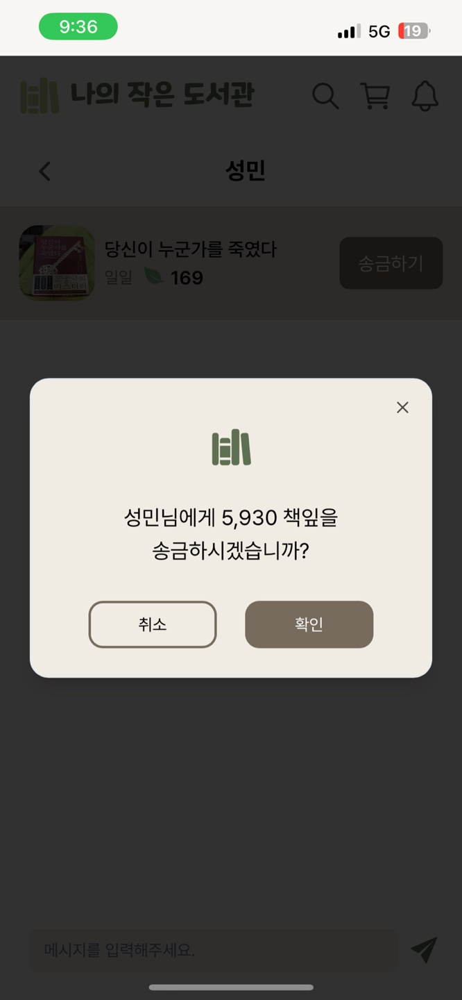
  
    
  
  
2.4 책 반납 후 상호 매너 평가

  
&emsp; 도서 대출 및 반납이 끝나면 상호 거래 후기를 남깁니다.

  
  
    
  
  
2.5 알람 기능 

  
&emsp; 푸시 알림을 통해 대출 및 반납 정보를 받을 수 있습니다.  

  
  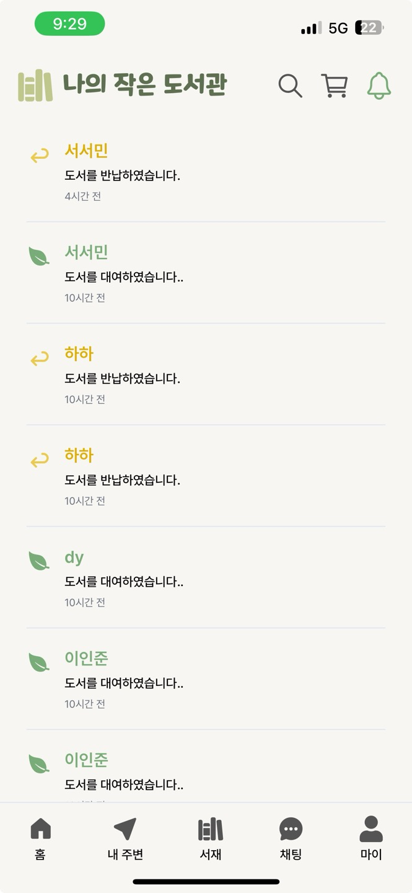
  
 
  
* ### **3.&nbsp; 메타데이터를 기반으로 한 책 추천 기능**
  
3.1 가입 시 정보 입력

  
&emsp; 가입 시 연령, 성별, 관심 분야를 간단하게 선택하여 입력받습니다.

  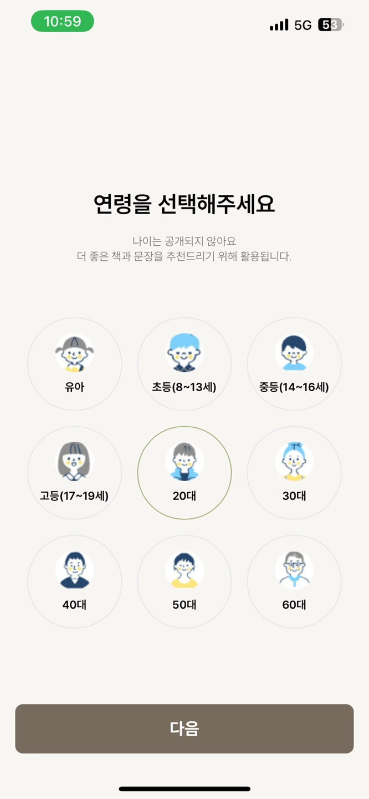
  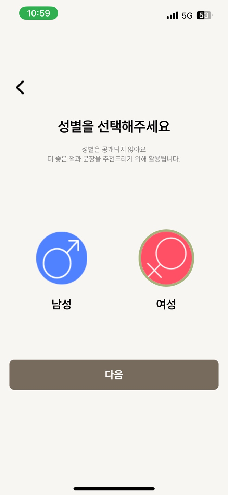  
  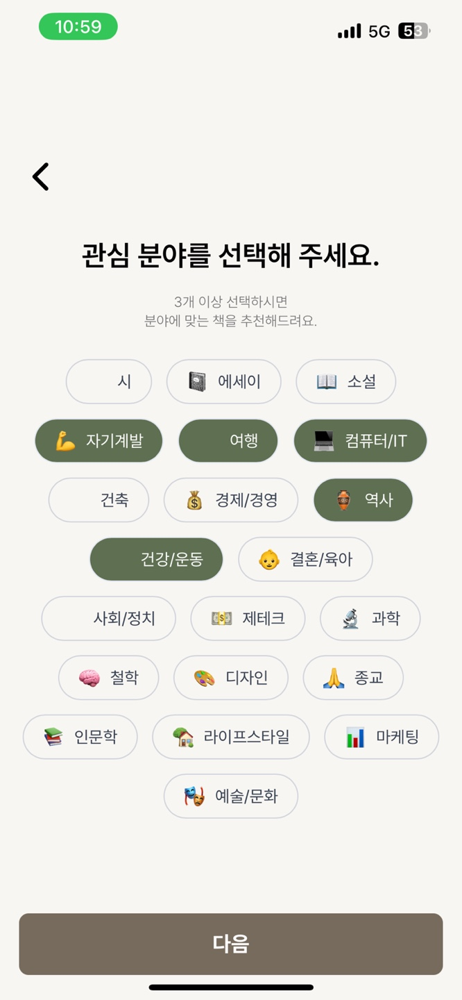  
    
  
  
3.2 사용자 선호도 수집

  
&emsp; 좋아요 기능을 통해 사용자의 선호도를 수집합니다.

  
  
  
&emsp; 도서 대여 기록을 통해 사용자의 선호도를 수집합니다.

  
  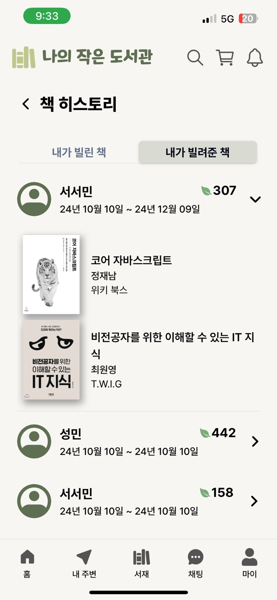
    
  
  
3.4 특정 책 패이지의 체류 시간

  
&emsp; 도서 상세 페이지에 체류한 시간을 계산하여 데이터로 활용합니다.

   
  
  
3.5 메타데이터를 기반으로 한 책 추천

  
  
  
    
 
  
* ### **4.&nbsp; 위치 정보를 이용한 동네 기반 서비스**
  
4.1 지역 및 범위 설정

  
&emsp; 현재 나의 위치를 기반으로 가까운 동네 리스트를 볼 수 있습니다.

  
&emsp; 책장을 공유할 지역과 그 범위를 설정합니다.

  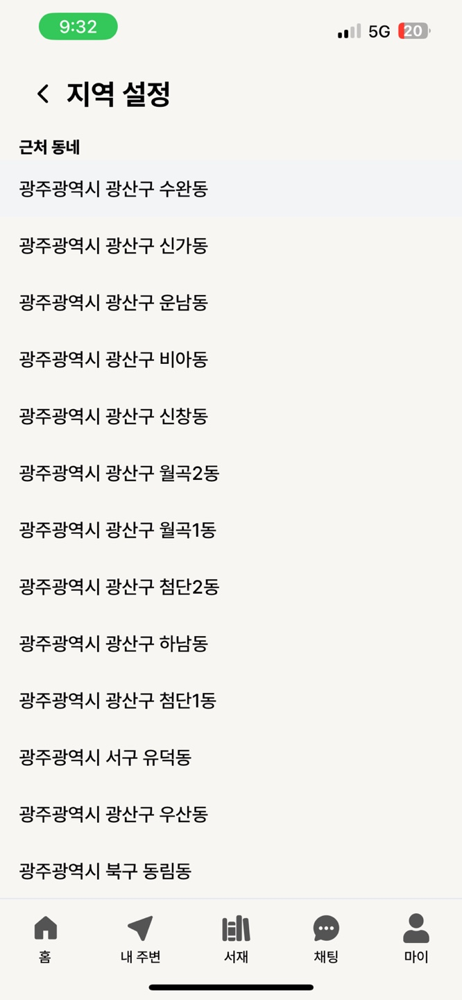
  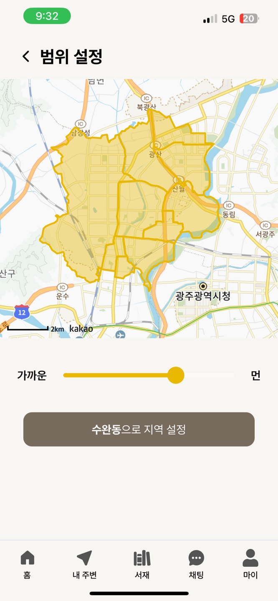
    
  
  
4.2 위치 기반 책장 정보 

  
&emsp; 도서를 공유할 수 동네 책장을 볼 수 있습니다.

  

    
 

# 📚 산출물

##### [⚙ Architecture](./readme-image/Architecture.png)

##### [⚙ ERD](./readme-image/erd.png)

##### [📋 요구사항 명세서]()

##### [📋 API 명세서](./readme-image/Swagger)

##### [🎞 UCC](https://www.youtube.com/watch?v=3rQWtE-nxIk)

  

### 커밋 컨벤션
- `[FEAT]` : 새로운 기능 추가

- `[FIX]` : 버그 수정

- `[DOCS]` : 문서 수정

- `[STYLE]` : 코드 포맷팅, 세미콜론 누락, 코드 변경이 없는 경우

- `[REFACTOR]`: 코드 리펙토링DOCS

- `[TEST]` : 테스트 코드, 리펙토링 테스트 코드 추가

- `[CHORE]` : 빌드 업무 수정, 패키지 매니저 수정

- `[MERGE]` : 병합  

